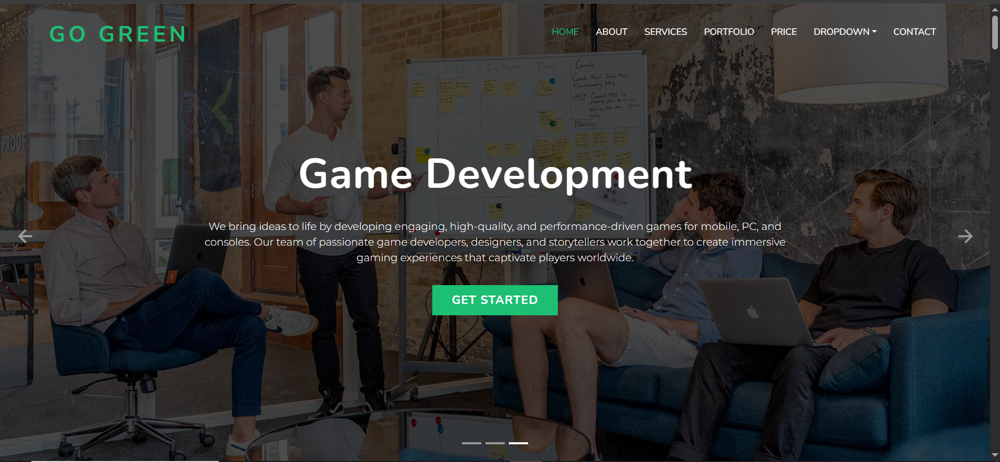

# INTRODUCTION:

Go Green - Company Portfolio Website 🌿🚀
Welcome to Go Green, a modern and professional company portfolio website designed to showcase services, projects, and expertise in web development, app development, and game development.

# 📌 Features
✅ Responsive Design – Fully optimized for all screen sizes.
✅ Modern UI/UX – Clean and professional user interface.
✅ Services Showcase – Highlights the expertise in web, app, and game development.
✅ Portfolio Section – Displays completed projects and achievements.
✅ Testimonials & Clients – Builds trust with real client feedback.
✅ SEO Optimized – Built with best SEO practices for better visibility.

# 🛠️ Technologies Used
Frontend: HTML, CSS, JavaScript, Bootstrap/Tailwind

Version Control: Git & GitHub

Deployment: Vercel/Netlify (if hosted)

# 📂 Project Structure

Go-Green_Portfolio/          # Root folder of project
│── css/                     # Stylesheets folder
│   ├── style.css            # Main CSS file
│        
│
│── js/                      # JavaScript files
│   ├── script.js            # Main JavaScript file
│   
│
│── img/                     # Images folder         
│   ├── Other images
│   ├── SampleImage.png      # Example image
│
│── vendor/                  # Additional pages and components
│   ├── about.html           # About Us page
│   ├── contact.html         # Contact Us page
│   ├── portfolio.html       # Portfolio page
│   ├── price.html           # Pricing page
│   ├── service.html         # Services page
│
│── index.html               # Main Homepage
│── README.md                # Project Documentation

# 🚀 Installation & Setup
1. Clone the Repository

git clone https://github.com/your-username/go-green-portfolio.git
2. Navigate to the Project Folder

cd go-green-portfolio
3. Open in Browser

Simply open index.html in your browser.

# 📸 Screenshots

# 📞 Contact
For any queries or collaborations, reach out at:
📧 Email: sumitkushwaha99375@gmail.com
📱 LinkedIn: linkedin.com/in/your-profile

# 📜 License
This project is licensed under the MIT License – feel free to modify and use it.

